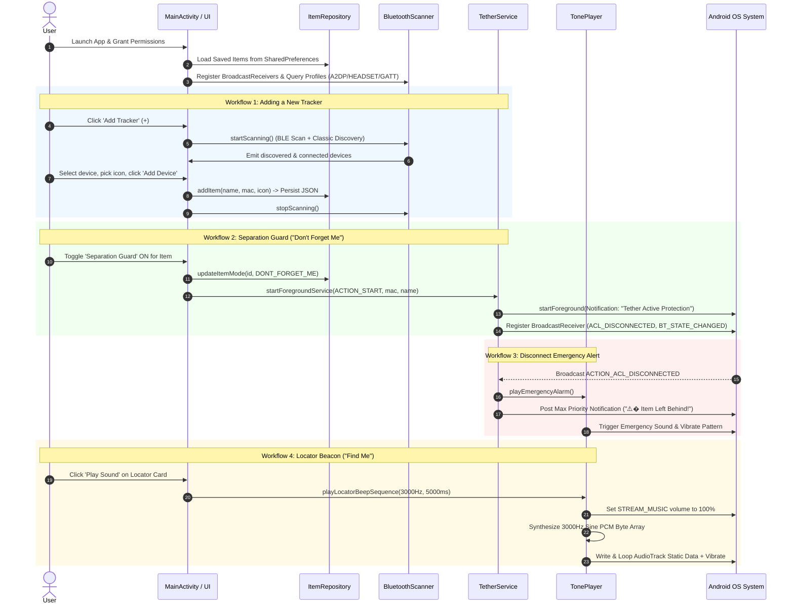
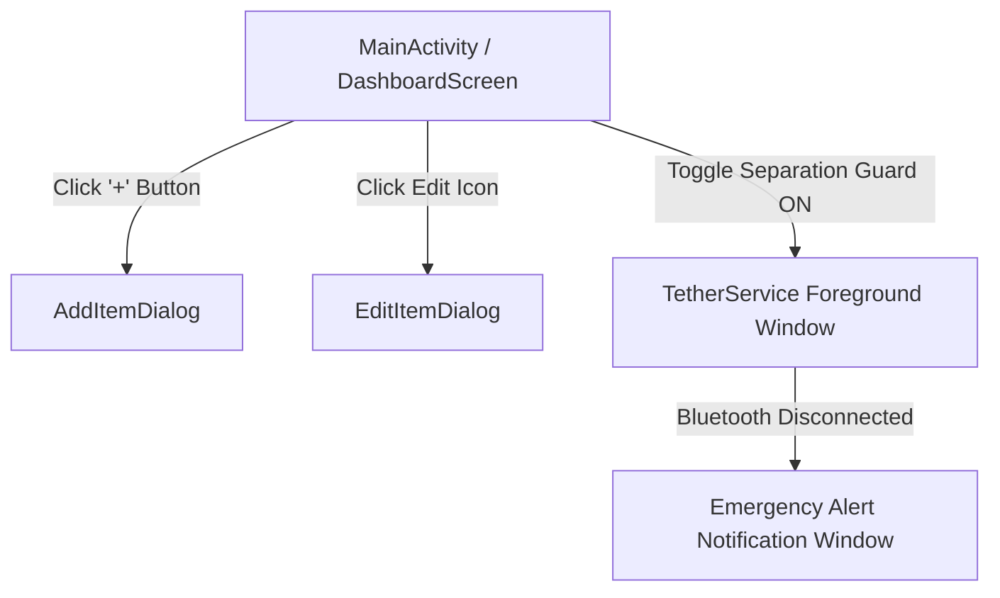

# Tether - Comprehensive Application Documentation & Architecture Manual

## 1. Executive Summary & Hardware Context

**Tether** is a specialized Android companion application engineered for a custom DIY Bluetooth item tracking hardware platform.

### The Hardware Tracker
The hardware tracker is constructed from salvaged Bluetooth earbud electronics with key modifications:
- **Latched Power State**: The original multifunction button is physically latched down, ensuring the unit remains permanently powered and continuously broadcastable/connectable without powering off.
- **High-Capacity Power Cell**: The factory micro-battery was replaced with a larger lithium cell for extended operation.
- **High-Decibel Speaker Driver**: The tiny earbud speaker driver was replaced with a larger acoustic transducer coupled through a **1000 µF capacitor** to block DC bias and maximize acoustic output.

### Application Operational Modes
1. 🔗 **Separation Guard Mode ("Don't Forget Me")**: 
   - Protects critical items like keys, wallet, or backpack.
   - Maintains an active Bluetooth link between the phone and tracker.
   - If the user walks away and the connection breaks (or Bluetooth is toggled off), the background foreground service immediately triggers a high-priority emergency alarm (max volume tone sequence + high-intensity vibration pattern + heads-up alert notification).
2. 🔍� **Locator Beacon Mode ("Find Me")**:
   - Designed for lost item recovery.
   - Emits a high-frequency (3000 Hz) audio tone directly through the connected tracker / phone audio system at 100% volume alongside phone vibration to locate misplaced items nearby.

---

## 2. How the App Works (End-to-End Technical Workflows & Mechanics)



### End-to-End Mechanics Breakdown

1. **Permission Initialization & Startup**:
   - On startup, [`MainActivity`](file:///e:/android_studio_projects/Tether/app/src/main/java/com/example/tether/MainActivity.kt) requests Android 12+ Bluetooth permissions (`BLUETOOTH_SCAN`, `BLUETOOTH_CONNECT`), Location (`ACCESS_FINE_LOCATION`), and Notifications (`POST_NOTIFICATIONS`).
   - [`ItemRepository`](file:///e:/android_studio_projects/Tether/app/src/main/java/com/example/tether/data/ItemRepository.kt) deserializes stored trackers from JSON in `SharedPreferences`.

2. **Multi-Protocol Bluetooth Device Scanning & Detection**:
   - [`BluetoothScanner`](file:///e:/android_studio_projects/Tether/app/src/main/java/com/example/tether/bluetooth/BluetoothScanner.kt) initiates low-latency BLE scanning via `BluetoothLeScanner.startScan()` and Classic Bluetooth discovery via `BluetoothAdapter.startDiscovery()`.
   - Simultaneously queries `BluetoothProfile.A2DP` (Bluetooth Audio/Earbuds), `BluetoothProfile.HEADSET` (Calls/Mono), and `BluetoothProfile.GATT` (BLE Wearables/Trackers) proxy interfaces to accurately detect connected devices even if BLE scanning is restricted.

3. **Background Separation Guard Engine**:
   - When a user enables Separation Guard on a tracker, `MainActivity` launches [`TetherService`](file:///e:/android_studio_projects/Tether/app/src/main/java/com/example/tether/service/TetherService.kt) as a Foreground Service with an ongoing notification.
   - `TetherService` listens to system intents `BluetoothDevice.ACTION_ACL_DISCONNECTED` and `BluetoothAdapter.ACTION_STATE_CHANGED`.
   - If the target tracker disconnects or phone Bluetooth is turned off, the service fires an emergency alarm: pushes a max-priority heads-up alert notification, executes high-intensity vibration, and plays error tones via [`TonePlayer`](file:///e:/android_studio_projects/Tether/app/src/main/java/com/example/tether/audio/TonePlayer.kt).

4. **Locator Beacon Audio Synthesis Engine**:
   - When the user presses "Play Sound", `TonePlayer` dynamically synthesizes a **3000 Hz pure sine wave** in PCM 16-bit 44.1kHz mono format.
   - Maximizes Android system media volume (`AudioManager.STREAM_MUSIC`) to 100%.
   - Streams pulses into low-level `AudioTrack` in `MODE_STATIC` mode with rapid reload cycles (`reloadStaticData()`) to create high-frequency beeps optimized for the hardware's 1000 µF coupled transducer.

---

## 3. Libraries, Frameworks & Dependencies Used

The application relies on modern Android Jetpack libraries and standard Kotlin runtime tools:

| Library / Dependency | Artifact Reference | Purpose & Usage in App |
| :--- | :--- | :--- |
| **Jetpack Compose BOM** | `androidx.compose:compose-bom` | Manages synchronized, compatible versions for all Compose UI libraries. |
| **Compose Material3** | `androidx.compose.material3:material3` | Provides Material Design 3 UI components (`Scaffold`, `Card`, `Button`, `OutlinedTextField`, `Switch`, `AlertDialog`, `Surface`). |
| **Compose Extended Icons** | `androidx.compose.material.icons:material-icons-extended` | Material vector icons (`VpnKey`, `AccountBalanceWallet`, `Backpack`, `Build`, `DirectionsCar`, `Headphones`, `VolumeUp`, `VolumeOff`, `Route`). |
| **Compose UI & Graphics** | `androidx.compose.ui:ui`, `ui-graphics`, `ui-tooling-preview` | Core declarative UI rendering tree, canvas drawing, layouts, and preview tools. |
| **Activity Compose** | `androidx.activity:activity-compose` | Integrates Jetpack Compose with Android `ComponentActivity` (`setContent`). |
| **Lifecycle Runtime Compose** | `androidx.lifecycle:lifecycle-runtime-compose` | Provides `collectAsStateWithLifecycle()` to safely observe Kotlin `StateFlow` streams according to lifecycle state. |
| **AndroidX Core KTX** | `androidx.core:core-ktx` | Kotlin extensions for Android framework APIs (compat helpers, notification builders). |
| **AndroidX AppCompat** | `androidx.appcompat:appcompat` | Backwards compatibility support for Android components. |
| **Google Material Components** | `com.google.android.material:material` | View-system fallback styling and Material theme bridges. |
| **Kotlin Coroutines** | `org.jetbrains.kotlinx:kotlinx-coroutines-core` / `android` | Asynchronous programming, non-blocking audio generation timing, and background job scheduling. |

---

## 4. Android System APIs & Framework Services Used

```
                               ┌─────────────────────────────────────────┐�
                               │        Android OS System APIs           │
                               └────────────────────┬────────────────────┐˜
                                                    │
         ┌───────────────────┬──────────────────────┼──────────────────────┬───────────────────┐�
         â–¼                   â–¼                      â–¼                      â–¼                   â–¼
┌──────────────────┐�┌──────────────────┐�┌──────────────────────┐�┌──────────────────┐�┌──────────────────┐�
│  Bluetooth APIs  ││    Audio APIs    ││   Foreground & OS    ││ Persistence APIs ││   Vibration API  │
├──────────────────┤├──────────────────┤├──────────────────────┤├──────────────────┤├──────────────────┤
│• BluetoothAdapter││• AudioTrack      ││• Service (Foreground)││• SharedPref      ││• Vibrator        │
│• BluetoothScanner││• AudioAttributes ││• NotificationManager ││• JSON Serialization│ VibratorManager│
│• BluetoothProfile││• AudioManager    ││• BroadcastReceiver   ││• StateFlow       ││• VibrationEffect │
└──────────────────┐˜└──────────────────┐˜└──────────────────────┐˜└──────────────────┐˜└──────────────────┐˜
```

### 1. Bluetooth Framework APIs (`android.bluetooth`)
- **`BluetoothManager` & `BluetoothAdapter`**: Used in [`BluetoothScanner`](file:///e:/android_studio_projects/Tether/app/src/main/java/com/example/tether/bluetooth/BluetoothScanner.kt) to manage local Bluetooth radio hardware, verify enabled status, and access system profile proxies.
- **`BluetoothLeScanner` & `ScanCallback`**: Executes low-latency BLE scans (`SCAN_MODE_LOW_LATENCY`) to discover nearby advertising Bluetooth trackers and obtain real-time RSSI signal strengths.
- **`BluetoothProfile.A2DP`, `HEADSET`, & `GATT`**: Profile proxies used to inspect active system connections. Ensures hardware earbuds connected as audio or hands-free devices are detected even if not actively advertising BLE packets.
- **`BluetoothDevice` Intent Broadcasts**: Listens for system hardware broadcasts (`ACTION_FOUND`, `ACTION_ACL_CONNECTED`, `ACTION_ACL_DISCONNECTED`, `ACTION_STATE_CHANGED`).

### 2. Audio & Sound APIs (`android.media`)
- **`AudioTrack`**: Used in [`TonePlayer`](file:///e:/android_studio_projects/Tether/app/src/main/java/com/example/tether/audio/TonePlayer.kt) for direct PCM audio buffer streaming (`MODE_STATIC`, 44.1kHz, PCM 16-bit). Allows precise frequency synthesis without relying on pre-recorded audio files.
- **`AudioAttributes` & `AudioFormat`**: Configures low-latency music usage (`USAGE_MEDIA`, `CONTENT_TYPE_MUSIC`).
- **`AudioManager`**: Accesses `Context.AUDIO_SERVICE` to programmatically force phone media volume (`STREAM_MUSIC`) to 100% maximum during locator beeps.
- **`ToneGenerator`**: Provides fallback DTMF system beeps (`TONE_PROP_BEEP`, `TONE_SUP_ERROR`) if `AudioTrack` initialization encounters system constraints.

### 3. Service, Notification & Broadcast APIs (`android.app` / `android.content`)
- **Foreground Service (`Service`)**: Implemented in [`TetherService`](file:///e:/android_studio_projects/Tether/app/src/main/java/com/example/tether/service/TetherService.kt) with `foregroundServiceType="connectedDevice"` to maintain uninterrupted background connection monitoring.
- **`NotificationChannel` & `NotificationManager`**: Configures two separate channels:
  - `tether_protection_channel` (Low importance): Persistent background monitoring indicator.
  - `tether_alert_channel` (High importance): Heads-up emergency alerts with screen activation, high priority sound, and custom vibration.
- **`BroadcastReceiver`**: Listens for system-wide Bluetooth state changes and ACL disconnect events in real-time.

### 4. Haptic Feedback APIs (`android.os`)
- **`Vibrator` & `VibratorManager`**: Triggers custom waveform vibration patterns (`VibrationEffect.createWaveform()`) during emergency alerts and locator sound playback across Android versions (supports Android 12+ `VibratorManager` as well as legacy `Vibrator`).

### 5. Persistence & State Management APIs
- **`SharedPreferences`**: Stores JSON-encoded tracker objects under `"tether_items_prefs"`.
- **Kotlin `StateFlow` / `MutableStateFlow`**: Provides reactive, observable state containers in `ItemRepository`, `BluetoothScanner`, and `TonePlayer`.

---

## 5. Directory Structure & File Map

```
Tether/
├── APP_DOCUMENTATION.md                             [System Documentation]
├── prompt.txt                                        [Original System Requirements & Hardware Spec]
├── build.gradle.kts                                  [Root Gradle Build Configuration]
├── settings.gradle.kts                               [Gradle Project & Repository Settings]
├── gradle.properties                                 [Gradle Environment Properties]
├── gradlew / gradlew.bat                             [Gradle Wrapper Executable Scripts]
├── local.properties                                  [Android SDK Directory Configuration]
└── app/
    ├── build.gradle.kts                              [App Module Dependencies & Android SDK Config]
    ├── proguard-rules.pro                            [R8/Proguard Optimization Rules]
    └── src/
        └── main/
            ├── AndroidManifest.xml                   [App Manifest, Permissions & Service Declarations]
            ├── java/com/example/tether/
            │   ├── MainActivity.kt                   [Main Activity & State Orchestrator]
            │   ├── audio/
            │   │   └── TonePlayer.kt                 [PCM Audio Synthesis & Alarm Engine]
            │   ├── bluetooth/
            │   │   └── BluetoothScanner.kt           [Bluetooth Scan, Connection & State Engine]
            │   ├── data/
            │   │   └── ItemRepository.kt             [SharedPreferences Persistence & Data Flow]
            │   ├── model/
            │   │   └── TrackedItem.kt                [Domain Models & Data Structures]
            │   ├── service/
            │   │   └── TetherService.kt              [Foreground Monitoring & Emergency Alert Service]
            │   └── ui/
            │       ├── screens/
            │       │   ├── AddItemDialog.kt          [Add Tracker Modal Dialog Component]
            │       │   ├── DashboardScreen.kt        [Main Application Dashboard & Monitored Items]
            │       │   └── EditItemDialog.kt         [Edit Tracker Details Dialog Component]
            │       └── theme/
            │           └── Theme.kt                  [Design System, Color Palette & Material3 Theme]
            └── res/                                  [Android Application Resources]
                ├── layout/                           [Legacy Layout Schemas]
                ├── values/strings.xml                [String Resource Definitions]
                └── xml/                              [Backup & Extraction Rules]
```

---

## 6. Comprehensive File Descriptions & Responsibilities

| File Path | Description & Core Responsibilities |
| :--- | :--- |
| [`MainActivity.kt`](file:///e:/android_studio_projects/Tether/app/src/main/java/com/example/tether/MainActivity.kt) | **Entry Point & State Coordinator**. Initializes singletons (`ItemRepository`, `TonePlayer`, `BluetoothScanner`), handles runtime permission requests (Bluetooth Scan/Connect, Location, Notifications), manages dialog visibility states, and bridges UI events with foreground services. |
| [`TonePlayer.kt`](file:///e:/android_studio_projects/Tether/app/src/main/java/com/example/tether/audio/TonePlayer.kt) | **Audio Synthesis & Vibration Engine**. Uses low-level `AudioTrack` PCM synthesis to generate 3000 Hz locator beeps, forces system media volume to 100% for maximum audio output, triggers fallback `ToneGenerator` audio, and controls multi-pulse `Vibrator` haptic patterns. |
| [`BluetoothScanner.kt`](file:///e:/android_studio_projects/Tether/app/src/main/java/com/example/tether/bluetooth/BluetoothScanner.kt) | **Bluetooth Operations Engine**. Combines BLE `BluetoothLeScanner` and Classic Bluetooth discovery with `BluetoothProfile.A2DP`, `HEADSET`, and `GATT` connection inspection. Provides real-time device categorization (Connected, Paired, Discovered) and includes an active RSSI simulation fallback feed. |
| [`ItemRepository.kt`](file:///e:/android_studio_projects/Tether/app/src/main/java/com/example/tether/data/ItemRepository.kt) | **Data Layer & Persistence**. Manages `StateFlow<List<TrackedItem>>`, persists items as JSON strings inside `SharedPreferences` (`tether_items_prefs`), enforces MAC address duplicate prevention, updates mode/RSSI states, and handles item CRUD operations. |
| [`TrackedItem.kt`](file:///e:/android_studio_projects/Tether/app/src/main/java/com/example/tether/model/TrackedItem.kt) | **Data Models & Enums**. Defines `TrackedItem` data class, `TrackerMode` (`IDLE`, `FIND_ME`, `DONT_FORGET_ME`), `ItemIcon` (`KEYS`, `WALLET`, `BACKPACK`, `TOOLBOX`, `CAR_KEYS`, `HEADPHONES`, `GENERIC`), and computes proximity ratios/labels based on RSSI dBm values. |
| [`TetherService.kt`](file:///e:/android_studio_projects/Tether/app/src/main/java/com/example/tether/service/TetherService.kt) | **Foreground Service & Separation Alert System**. Operates persistent foreground monitoring (`tether_protection_channel`). Listens to system broadcasts for `ACL_DISCONNECTED` and `BLUETOOTH_STATE_CHANGED`. Triggers high-priority emergency notifications and alarm sound/vibration when a guarded item breaks connection. |
| [`DashboardScreen.kt`](file:///e:/android_studio_projects/Tether/app/src/main/java/com/example/tether/ui/screens/DashboardScreen.kt) | **Main Dashboard Screen UI**. Displays Top Bar with hardware logo replica, Locator Beacon instrument card, monitored trackers list sorted by connectivity, empty state placeholders, item edit/delete controls, and Separation Guard toggle switches. |
| [`AddItemDialog.kt`](file:///e:/android_studio_projects/Tether/app/src/main/java/com/example/tether/ui/screens/AddItemDialog.kt) | **Add Tracker Modal UI**. Provides custom item name entry, category icon grid selector (6 choices), categorized Bluetooth device selection cards (Connected, Paired, Discovered), and duplicate MAC address validation warning banners. |
| [`EditItemDialog.kt`](file:///e:/android_studio_projects/Tether/app/src/main/java/com/example/tether/ui/screens/EditItemDialog.kt) | **Edit Tracker Modal UI**. Allows updating item name and category icon for an existing tracker while displaying its read-only MAC address. |
| [`Theme.kt`](file:///e:/android_studio_projects/Tether/app/src/main/java/com/example/tether/ui/theme/Theme.kt) | **Design System & Theme Tokens**. Implements dark and light Material3 color schemes anchored on Slate 900 (`#0F172A`), Precision Steel Blue (`#3B82F6`), Emerald Green (`#10B981`), and Crimson Alert Red (`#EF4444`). |
| [`AndroidManifest.xml`](file:///e:/android_studio_projects/Tether/app/src/main/AndroidManifest.xml) | **App Manifest**. Declares required system permissions (Bluetooth, Location, Foreground Service, Notifications, Vibration), single `MainActivity` launcher, and `TetherService` foreground service configuration (`foregroundServiceType="connectedDevice"`). |
| [`build.gradle.kts` (App)](file:///e:/android_studio_projects/Tether/app/build.gradle.kts) | **App Build Script**. Configures compileSdk 36, minSdk 24, Compose compiler options, and dependencies (Material3, Extended Icons, Lifecycle Compose). |

---

## 7. Application Windows, Screens & Dialog Layouts

The application consists of one primary activity hosting Compose screens and modal dialogs, alongside system-level notification windows:



### Screen 1: Main Dashboard (`DashboardScreen`)
- **Top Bar Header**: Contains the Tether hardware route logo badge (Slate 900 icon on White surface tile), application title, active monitored device count, and an **Add Tracker (+)** icon button.
- **Locator Beacon Instrument Card**: Positioned at the top of the content area. Features a volume status icon (changes color and animation state during tone playback), frequency indicator label ("Beeping at max frequency..." or "Trigger high-frequency sound"), and the **Play Sound / Stop Sound** action button.
- **Monitored Trackers List**: A scrollable vertical list displaying item cards sorted by active connection status. Each card shows:
  - Custom Category Icon (Keys, Wallet, Backpack, etc.)
  - Item Name & MAC Address
  - Real-time Connection Badge (`GUARD ACTIVE`, `CONNECTED`, or `DISCONNECTED`)
  - Item Edit Button & Delete Button
  - **Separation Guard** toggle switch
- **Empty State Container**: Displayed when no trackers exist in storage. Prompts user with a hardware sensor icon and an **Add First Device** primary button.
- **Floating Action Button (FAB)**: Anchored at the bottom-right corner when device list is not empty.

### Screen 2: Add New Tracker Dialog (`AddItemDialog`)
- **Header**: "Add New Tracker" modal title.
- **Name Input Field**: `OutlinedTextField` for entering custom labels (e.g. "Car Keys").
- **Category Icon Grid**: 6 selectable icon boxes (`KEYS`, `WALLET`, `BACKPACK`, `TOOLBOX`, `CAR_KEYS`, `HEADPHONES`).
- **Bluetooth Device Picker**: Lazy column listing nearby/system Bluetooth devices grouped under 3 header sections:
  1. `CONNECTED DEVICES` (Active audio/headset/GATT connections)
  2. `PAIRED DEVICES` (Bonded system devices)
  3. `DISCOVERED NEARBY` (Live BLE/Classic scan results)
- **Duplicate MAC Warning**: If a selected device MAC matches an already tracked item, displays a Crimson card with a warning icon and disables confirmation.
- **Action Buttons**: **Add Device** (Confirm) and **Cancel** (Dismiss).

### Screen 3: Edit Tracker Details Dialog (`EditItemDialog`)
- **Header**: "Edit Tracker Details" modal title.
- **MAC Address Banner**: Displays read-only MAC string for reference.
- **Name Input Field**: Editable text field pre-filled with current name.
- **Category Icon Grid**: 6 icon selection boxes pre-selected to current item icon.
- **Action Buttons**: **Save Changes** (Confirm) and **Cancel** (Dismiss).

### Window 4: System Foreground Service & Emergency Notification Window
- **Persistent Monitoring Notification**: Low-priority ongoing notification (`Tether Active Protection`) keeping the service alive in background.
- **Emergency Alert Window**: High-priority heads-up notification (`⚠️� TETHER ALERT: Item Left Behind!`) triggered when a guarded device disconnects. Accompanied by loud alarm tones and phone vibration pattern (`0, 500, 200, 500, 200, 500, 200, 1000`).

---

## 8. Master Button & Interactive Control Registry

Below is a detailed inventory of **every button and interactive UI control** in the Tether application:

| # | Button / Element Name | Icon / Component | Location / Screen | Enabled State / Condition | Action / Trigger Effect |
| :---: | :--- | :--- | :--- | :--- | :--- |
| **1** | **Add Tracker (Top Bar)** | `Icons.Default.Add` | `DashboardScreen` TopAppBar action slot | Always Enabled | Triggers `onAddNewItem()`: Starts Bluetooth LE & Classic discovery scan and opens `AddItemDialog`. |
| **2** | **Add Tracker (FAB)** | `Icons.Default.Add` | `DashboardScreen` Bottom-Right Floating Action Button | Visible & Enabled when `items.isNotEmpty()` | Triggers `onAddNewItem()`: Starts Bluetooth scan and opens `AddItemDialog`. |
| **3** | **Add First Device** | `Icons.Default.Add` + Text | `DashboardScreen` Empty State Container | Visible when `items.isEmpty()` | Triggers `onAddNewItem()`: Starts Bluetooth scan and opens `AddItemDialog`. |
| **4** | **Play Sound / Stop Sound** | `VolumeUp` / `Stop` | `DashboardScreen` Locator Beacon Card | Enabled when `isBeeping` OR `hasConnectedDevice` | Triggers `onTriggerBeep()`:<br>• If currently beeping: Stops sound immediately.<br>• If idle & device connected: Maximizes media volume to 100%, plays 3000 Hz PCM tone sequence, and triggers phone vibration.<br>• If idle & no device connected: Shows Toast warning *"Cannot play sound: No Bluetooth tracker connected"*. |
| **5** | **Edit Tracker** | `Icons.Default.Edit` | `TrackedItemCard` Header (Right side) | Always Enabled | Triggers `onEditItem(item)`: Opens `EditItemDialog` populated with the target item's data. |
| **6** | **Delete Tracker** | `Icons.Default.DeleteOutline` (Crimson) | `TrackedItemCard` Header (Far right) | Always Enabled | Triggers `onRemoveItem(id)`: Removes item from repository & storage. If Separation Guard was active for this item, stops `TetherService`. |
| **7** | **Separation Guard Switch** | `Switch` Component | `TrackedItemCard` Bottom Row | Always Enabled | Triggers `onToggleTetherGuard(item, enable)`:<br>• **ON**: Sets mode to `DONT_FORGET_ME`, starts `TetherService` foreground service.<br>• **OFF**: Sets mode to `IDLE`, stops `TetherService` foreground service. |
| **8** | **Category Icon Selectors (6 Tiles)** | Keys, Wallet, Backpack, Toolbox, Car Keys, Headphones Icons | `AddItemDialog` & `EditItemDialog` Icon Grid | Always Enabled | Updates `selectedIcon` state variable to chosen icon; updates visual highlight background. |
| **9** | **Bluetooth Device Selection Card** | Custom Surface Card | `AddItemDialog` Device List LazyColumn | Always Enabled | Selects target Bluetooth device (`selectedDevice = dev`). Automatically copies device name to text input if name field is blank. |
| **10** | **Add Device (Confirm)** | Primary Solid Button | `AddItemDialog` Bottom Right | Enabled when `name.isNotBlank() && selectedDevice != null && !isDuplicate` | Calls `onConfirm`: Adds new tracker to `ItemRepository`, persists to SharedPreferences, stops scanning, and closes dialog. |
| **11** | **Cancel (Add Dialog)** | `TextButton` | `AddItemDialog` Bottom Left | Always Enabled | Calls `onDismiss`: Stops Bluetooth scanning and closes dialog without saving. |
| **12** | **Save Changes (Confirm)** | Primary Solid Button | `EditItemDialog` Bottom Right | Enabled when `name.isNotBlank()` | Calls `onConfirm`: Updates item name and category icon in `ItemRepository`, persists changes, and closes dialog. |
| **13** | **Cancel (Edit Dialog)** | `TextButton` | `EditItemDialog` Bottom Left | Always Enabled | Calls `onDismiss`: Closes dialog without making changes. |
| **14** | **Tracker Name TextField** | `OutlinedTextField` | `AddItemDialog` & `EditItemDialog` | Always Enabled | Accepts user keystrokes to update state `name`. |
