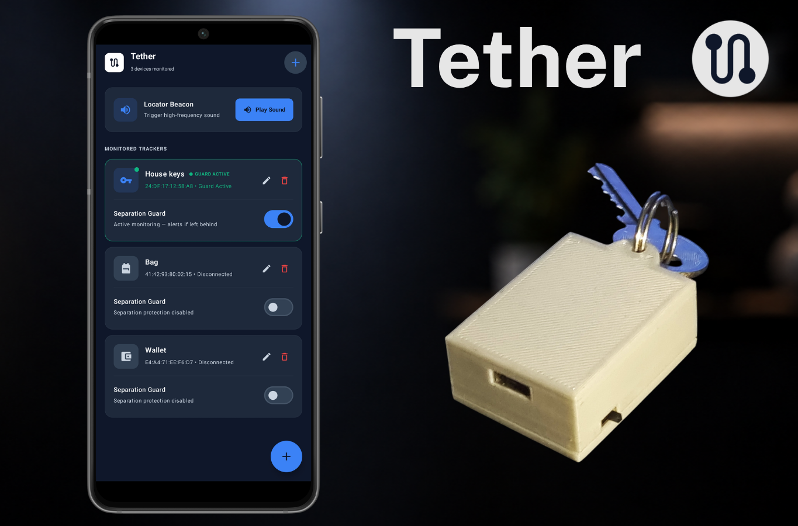
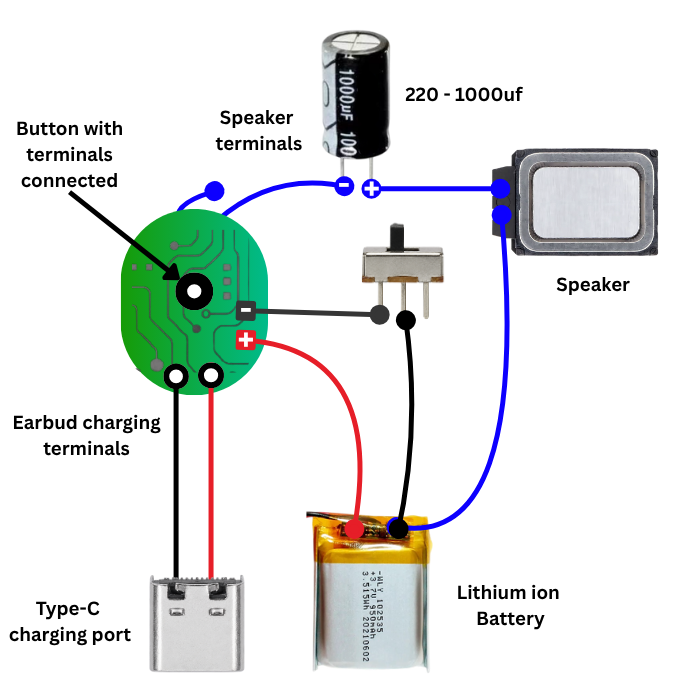

<p align="center">
  
</p>

<p align="center">
  
</p>

<h1 align="center">Tether</h1>

<p align="center">
  <strong>A DIY Bluetooth item tracker built entirely from salvaged electronics</strong>
</p>

<p align="center">
  
  
  
  
  
</p>

<p align="center">
  
  
  
</p>

---

## 🧭 The Problem

Everyone has that one object they always lose- keys, wallet, the remote, a single shoe. You put it down, walk away, and twenty minutes later you're on your knees checking under the couch. Half the time you find it. The other half you give up, buy a replacement, and the original turns up a week later somewhere obvious.

It happens the other way too. You get to work and realize your bag is still on the chair at home. You're out hiking and drop something without noticing.

**Tether covers both scenarios** - and it does it with zero new parts.

## 💡 What Makes Tether Different

Most Bluetooth trackers need a custom PCB, a microcontroller, firmware, and a factory. Tether needs **none of that**. The entire tracker is built from:

| Component | Source |
| :--- | :--- |
| **Bluetooth earbud** | A dead/discarded pair - carries the radio, pairing logic, and audio path |
| **Lithium cell** | From the earbud's own charging case - weeks of runtime instead of hours |
| **Speaker** | From an old phone - louder than any stock earbud driver |
| **1000 µF capacitor** | From a scrap phone charger - blocks DC offset for maximum volume |
| **USB-C port** | From a broken charger - for recharging |
| **Slide switch** | From any scrap board - power on/off |

No microcontrollers. No commercial sensor boards. No firmware to flash. **Anyone can build one.**

<p align="center">
  
</p>

---

## 📱 The App

Tether ships with an Android companion app written in **Kotlin** with **Jetpack Compose** and **Material Design 3**. The app has two modes:

### 🔗 Mode 1 - Separation Guard ("Don't Forget Me")

Attach the tracker to something you always leave behind (keys, wallet, backpack). Toggle **Separation Guard** on, and the app holds an active Bluetooth connection in the background.

Walk too far away? The link drops. The app catches it instantly via Android's `ACL_DISCONNECTED` broadcast and fires:

- 🔊 **Full-volume alarm tone**
- 📳 **Burst vibration pattern**
- 🔔 **Heads-up emergency notification**

No polling. No keep-alive pings. The Bluetooth connection itself is the sensor.

### 🔍 Mode 2 - Locator Beacon ("Find Me")

Lost something? Tap **Play Sound** and the app:

1. Forces phone media volume to **100%**
2. Synthesizes a **3000 Hz pure sine wave** in real-time
3. Streams it through the tracker's speaker at maximum output

The 1000 µF capacitor bridged across the speaker leads blocks DC offset, resulting in a beep loud enough to hear through furniture and across rooms.

---

## 🏗️ Architecture

```
Tether/
├── app/src/main/java/com/example/tether/
│   ├── MainActivity.kt              # Entry point & permission orchestrator
│   ├── audio/
│   │   └── TonePlayer.kt            # PCM synthesis & vibration engine
│   ├── bluetooth/
│   │   └── BluetoothScanner.kt      # BLE + Classic + Profile scanning
│   ├── data/
│   │   └── ItemRepository.kt        # SharedPreferences persistence & StateFlow
│   ├── model/
│   │   └── TrackedItem.kt           # Domain models & enums
│   ├── service/
│   │   └── TetherService.kt         # Foreground service & separation alerts
│   └── ui/
│       ├── screens/
│       │   ├── DashboardScreen.kt    # Main dashboard UI
│       │   ├── AddItemDialog.kt      # Add tracker dialog
│       │   └── EditItemDialog.kt     # Edit tracker dialog
│       └── theme/
│           └── Theme.kt             # Material3 dark/light design system
└── AndroidManifest.xml               # Permissions & service declarations
```

### Key Technical Details

| Feature | Implementation |
| :--- | :--- |
| **Audio Synthesis** | Raw PCM 16-bit @ 44.1kHz via `AudioTrack` `MODE_STATIC` - no audio files needed |
| **Device Detection** | Multi-protocol: BLE scan + Classic discovery + A2DP/HEADSET/GATT profile queries |
| **Background Monitoring** | Android Foreground Service with `foregroundServiceType="connectedDevice"` |
| **Persistence** | JSON-serialized `SharedPreferences` with reactive `StateFlow` |
| **Alert System** | Dual notification channels (low-priority persistent + high-priority emergency) |

---

## ⚙️ Tech Stack

| Technology | Purpose |
| :--- | :--- |
| **Kotlin** | Primary language |
| **Jetpack Compose** | Declarative UI framework |
| **Material Design 3** | Design system & component library |
| **Kotlin Coroutines** | Async operations & background scheduling |
| **Android Bluetooth APIs** | BLE scanning, Classic discovery, profile management |
| **AudioTrack** | Low-level PCM audio synthesis |
| **Foreground Service** | Persistent background monitoring |

---

## 🔧 Hardware Build Guide

### Parts List

Everything comes from a scrap drawer:

1. **One Bluetooth earbud** from a dead or mismatched pair
2. **The lithium cell** from the earbud's charging case
3. **A speaker** from an old phone
4. **A 1000 µF electrolytic capacitor** from a scrap charger board
5. **A USB-C port** from a broken charger
6. **A slide switch** from any scrap PCB

### Assembly

1. Replace the earbud's micro-battery with the larger charging case cell
2. Replace the tiny earbud driver with the phone speaker
3. Wire the 1000 µF capacitor between the earbud audio output and the speaker (blocks DC bias)
4. Wire the slide switch between battery positive and the earbud's positive pad
5. Connect the USB-C port to the battery for charging

### Keeping the Earbud Awake

The hardest part: Bluetooth earbuds auto-sleep after 3–5 minutes when disconnected. The solution:

> **Physical button earbuds**: Solder the function button contacts together (permanently "held down")
>
> **Capacitive touch earbuds**: Run a wire from the touch trace → switch → small capacitor (0–100 pF) → ground

This keeps the earbud convinced its button is held, so it stays powered indefinitely.

---

## 🚀 Getting Started

### Prerequisites

- **Android Studio** Ladybug (2024.2.1) or newer
- **Android SDK** API 36 (compileSdk) / API 24+ (minSdk)
- **A Bluetooth earbud tracker** (built per the guide above)
- An Android phone with **Bluetooth 4.0+**

### Build & Run

```bash
# Clone the repository
git clone https://github.com/HallanO/Tether.git
cd Tether

# Open in Android Studio and sync Gradle
# Or build from command line:
./gradlew assembleDebug

# Install on connected device
./gradlew installDebug
```

### First-Time Setup

1. **Pair the earbud** in Android's Bluetooth Settings first
2. Open the Tether app and grant all requested permissions
3. Tap **+** to add a tracker → select your paired earbud
4. Set the tracker's volume once while connected (phone volume ≠ earbud volume)

---

## 📋 Permissions

| Permission | Why It's Needed |
| :--- | :--- |
| `BLUETOOTH_SCAN` | Discover nearby BLE devices |
| `BLUETOOTH_CONNECT` | Connect to and communicate with trackers |
| `ACCESS_FINE_LOCATION` | Required by Android for BLE scanning |
| `POST_NOTIFICATIONS` | Emergency disconnect alerts |
| `FOREGROUND_SERVICE` | Background separation monitoring |
| `VIBRATE` | Alert haptic feedback |

---

## 🌱 Why This Matters

Small consumer electronics - wireless earbuds, phone chargers, broken toys - are frequently discarded due to minor defects even though most of their internal electronics remain functional. At the same time, people buy replacement components without realizing a drawer of old electronics already holds the same working parts.

A similar pattern shows up with everyday items. Rather than searching for something misplaced, people buy a new one, adding to a pile of unnecessary purchases.

**Tether demonstrates that a useful product can emerge from what's already been thrown away** - reducing e-waste and avoiding unnecessary spending at the same time.

---

## 📄 License

This project is licensed under the [MIT License](LICENSE).

---

<p align="center">
  <strong>Built from what was thrown away. Works like it was always meant to.</strong>
</p>
